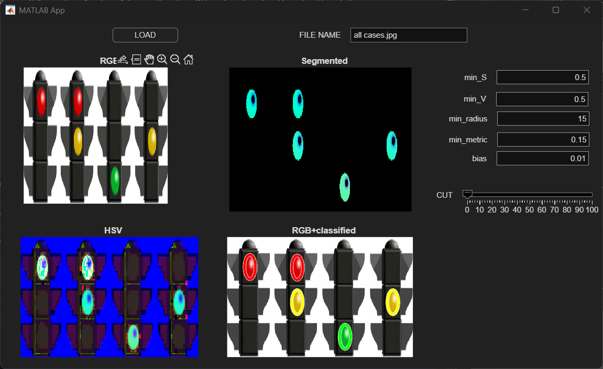

# Traffic Light Detection System

  This project implements a MATLAB-based traffic light detection and classification pipeline using HSV color segmentation and Circular Hough Transform (CHT).

  An interactive GUI was developed with MATLAB App Designer for real-time parameter tuning and visualization.

## Technical Features

### 1. HSV-Based Segmentation

RGB to HSV color space conversion

Saturation and brightness thresholding

Binary mask generation

Noise suppression using S/V filtering

### 2. Circle Detection

Traffic light candidates are detected using Circular Hough Transform (imfindcircles):

Radius-based filtering

Circle metric validation

Roundness analysis

### 3. Traffic Light Classification

Detected regions are classified as:

Red

Yellow

Green

using average hue analysis inside detected circular regions.

Invalid combinations (e.g. simultaneous red and green detections) are rejected.

## Interactive GUI

A custom MATLAB App Designer interface provides:

Real-time parameter tuning

Adjustable HSV thresholds

Radius and metric control

Live segmentation visualization

Detection result visualization

## Environment & Tools

MATLAB

MATLAB App Designer

Image Processing Toolbox

## File Structure

trafficLights.m  -> Traffic light detection pipeline

app1.mlapp     -> Interactive GUI

all cases.png  -> Test data
